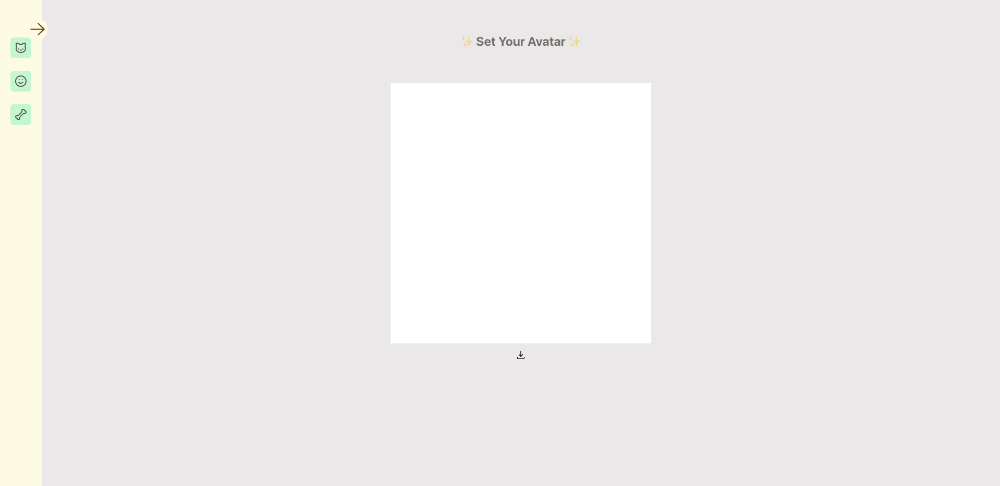
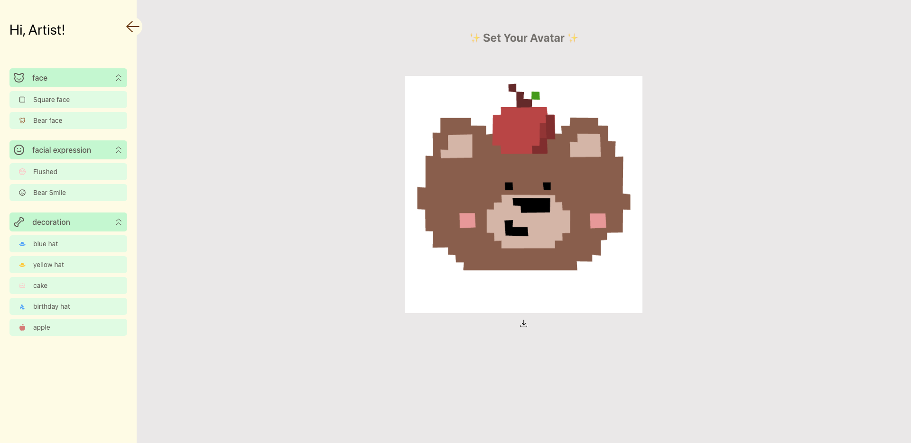

# Build-Your-Avatar 🧙

This web app is a simple avatar making tool that can help you build your own avatar by clicking and dragging pieces together! The objects can be moved around, resized, grouped, and rearranged. Have fun playing around with it!

This one-page application used React, Fabric.js, and tailwind css as frontend.
This web app is now deployed using GitHub Pages, and serving at 🍕🍕 [https://kukustudy.github.io/Set-Your-Colors/](https://kukustudy.github.io/Build-Your-Avatar/)

## What the running app looks like:

## To run this app in development mode
  1. clone this repository, cd to the project folder and run the following command in terminal
     
    `$ npm start`

  2. open another terminal, and run this command, this ensures tailwind css code is automically recompiled when you make changes

    `npx tailwindcss -i ./src/tailwind.css -o ./src/tailwindoutput.css --watch`
    
  Open [http://localhost:3000](http://localhost:3000) to view it in your browser. The page will reload when you make changes.
  
 

## To add new customised object into the app
  1.	Have a svg file of the shape you want, I created customised shape using a free software: Inkspace.
      Draw the shape using the pen tool, each color should be a different layer. 
      A full example of how to draw and export your drawing as plain SVG, check out this youtube video from 10:20 til the end:
      https://www.youtube.com/watch?v=eOd1RYjZXxg

 
  
  2. Load the svg file as a code piece
      Every svg file is actually just a piece of code, to retrieve this code, open the svg fiile in VS code. 
      By default, it will load as an image, right click on the svg file in the explorer, and select ‘reopen editor with …’
    
      And then select ‘Text Editor’

   

  3. Copy the string that started with `<svg>` and ended with `</svg>`
  
 

  4. paste the string inside the dictionary variable 'svgStringDict' which is located in build-your-avatar-app/src/AvatarHelper.js
     remember to give it a key, like "bluehat": `<svg> ... </svg>`
     noted that the string must embeded inside these two dots``
     
 

  6. expand getMenus function by copy and paste a submenuItem, you can change the icon as you like, for example: 
       '{
        title: "Square face",
        effect: () => addCustomisedShape(canvas, "squareface"),
        icon: <FaRegSquare />,
      }'
  

## Credit:
customised objects are created using Piskel and Inkscape
- Piskel, a free pixel art web app, https://www.piskelapp.com/p/create/sprite/
- Inkscape, a free svg art app, https://inkscape.org/

## References:
### how to create a canva and add new object to the canva using fabric.js
https://www.youtube.com/watch?v=eSiEBH7D1mM

### how to create a svg file using inkspace (for adding customised object)
watch from 10:20 til the end
https://www.youtube.com/watch?v=eOd1RYjZXxg

### how to add a side menu bar with expandable sub menu items using React
https://www.youtube.com/watch?v=MszSqhEw__8

